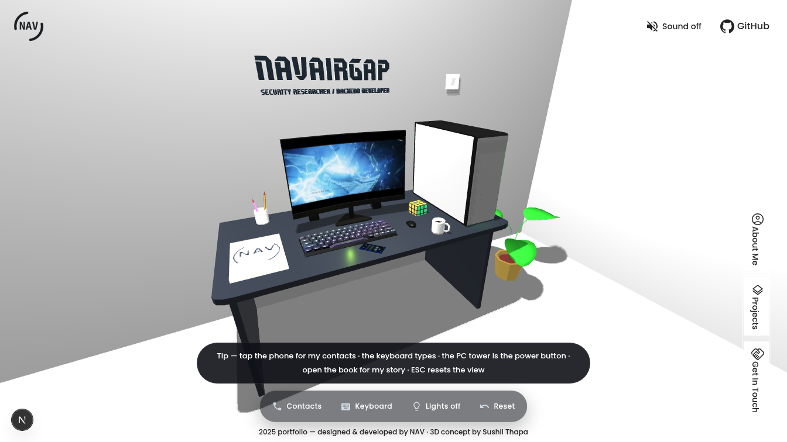

# NAVAIRGAP · 3D Interactive Portfolio



An interactive, photorealistic **3D portfolio** that runs in the browser. Explore a security researcher's room — click the monitor, peek at the keyboard, open the books, spin the Rubik's cube, and answer the phone.

Built with **Next.js + React Three Fiber**.

---

## ✨ Highlights

- 🖥️ **Fully interactive 3D room** — desk setup, honeycomb wall, plants, PC tower, phone, books & a Rubik's cube
- 🌗 **Day / Night themes** — toggling changes the sun, LED strips, screen glow, wall-text colors and the whole mood of the room
- 💎 **PBR materials** — normal / roughness / metalness maps on keycaps, honeycomb wall, desk, floor and tower
- 🌍 **HDRI environment lighting** + soft shadows (PCFSoft) + a monitor light that spills onto the desk
- 🎬 **Cinematic post-processing** — SSAO, bloom, depth of field and film grain, with an adaptive quality guard for weaker GPUs
- ⚡ **Performance-first** — Draco-compressed geometry, KTX2 GPU-native textures, LODs on the plant & PC tower
- 🔊 Subtle sound design on interactions

## 🧰 Tech Stack

| Layer      | Tech                                                        |
| ---------- | ----------------------------------------------------------- |
| Framework  | Next.js 16 (App Router) · React 19 · TypeScript             |
| 3D         | Three.js · React Three Fiber · custom postprocessing chain  |
| Styling    | Tailwind CSS 4 · shadcn/ui                                  |
| Assets     | GLB (Draco) · KTX2/Basis · HDRI (RGBE)                      |
| DB (optional) | Prisma + SQLite                                          |

## 🚀 Run It Locally

You need **Node.js 20+** (or [Bun](https://bun.sh)) installed.

```bash
git clone https://github.com/navairgap/3d-portfolio.git
cd 3d-portfolio
npm install     # or: bun install / pnpm install
npm run dev     # or: bun run dev
```

Then open **http://localhost:3000** — that's it. No environment variables are required for the 3D site.

> Optional: the project ships with a Prisma schema. If you want to use it, copy `.env.example` to `.env` first, then run `npm run db:push`.

## 📜 Scripts

| Command           | What it does                          |
| ----------------- | ------------------------------------- |
| `npm run dev`     | Start the dev server (port 3000)      |
| `npm run build`   | Create a production build             |
| `npm run start`   | Serve the production build            |
| `npm run lint`    | Run ESLint                            |
| `npm run db:push` | Push the Prisma schema to SQLite      |

## ▲ Deploy to Vercel

1. Sign up at [vercel.com](https://vercel.com) — easiest with **Continue with GitHub**
2. **Add New… → Project** → import this repository
3. Keep every default (Next.js is auto-detected) → **Deploy**
4. Your site goes live at `https://<project-name>.vercel.app`

No environment variables needed. After that, every `git push` to `main` re-deploys automatically.

## 🗂 Project Structure

```
src/
  app/                  # Next.js App Router — single-page entry
  components/
    portfolio/          # The whole 3D experience
      PortfolioExperience.tsx   # scene, lighting, camera, post-processing
      gamingKeyboard.ts         # keyboard model + PBR keycaps
      hexaWall.ts               # honeycomb wall w/ normal maps
      phoneScreen.ts            # in-world phone UI
      bookPage.ts               # book pages & covers
      rubiksCube.ts             # Rubik's cube
      floor.ts / carpet.ts      # floor + LED strips, rug
      pbr.ts                    # procedural normal/roughness map generators
      sounds.ts                 # interaction sounds
public/
  models/               # room.glb (Draco-compressed)
  textures/             # HDRI, KTX2, book covers, project art
  draco/  ktx2/         # decoders & transcoders
prisma/
  schema.prisma         # optional database schema
```

## 🙏 Credits

- HDRI environment map from the [three.js examples](https://threejs.org) collection
- Geometry & texture compression: Google [Draco](https://github.com/google/draco) + Binomial [Basis Universal](https://github.com/BinomialLLC/basis_universal) (transcoders bundled)
- Built with [Three.js](https://threejs.org), [React Three Fiber](https://docs.pmnd.rs/react-three-fiber), [Next.js](https://nextjs.org) & [shadcn/ui](https://ui.shadcn.com)

---

© NAVAIRGAP — security researcher & 3D tinkerer
